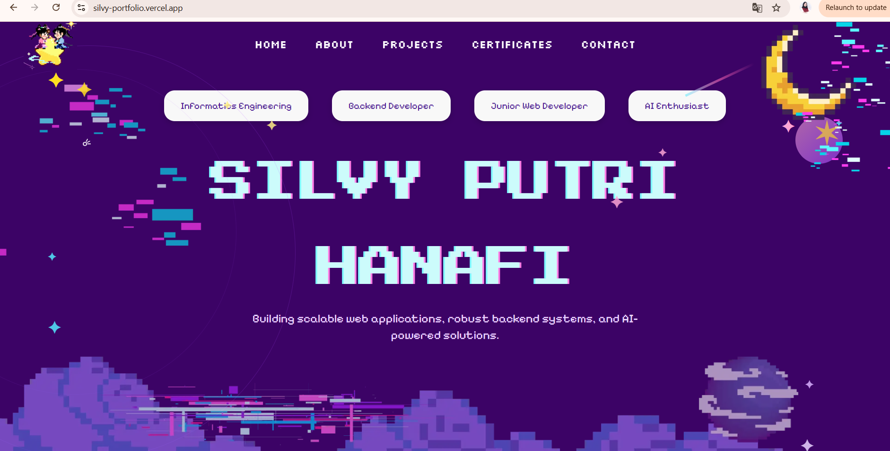
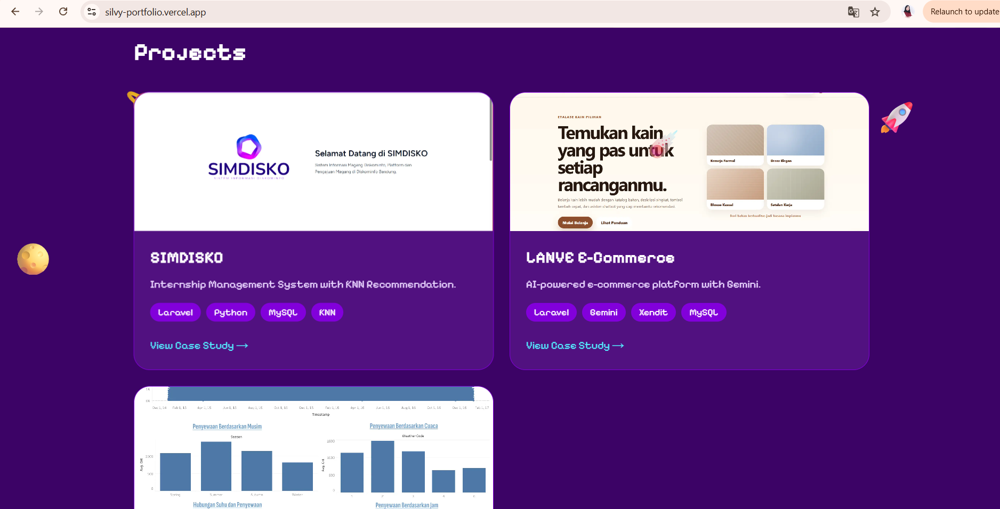
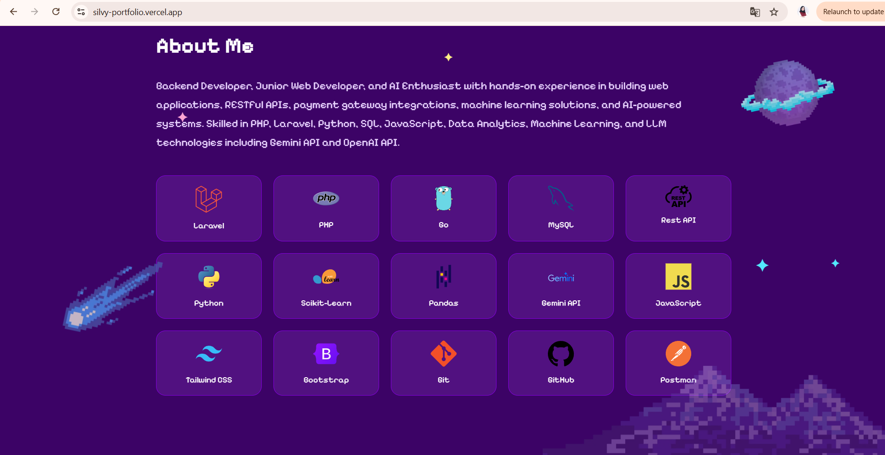

# 🌐 Personal Portfolio Website

A modern and responsive developer portfolio website built to showcase my software development, machine learning, and data analytics projects.

## 🚀 Live Demo

Portfolio Website:
https://silvy-portfolio.vercel.app

## 📌 Overview

This portfolio serves as a central hub for my technical projects, skills, certifications, and professional experiences.

The website highlights:

* Software Development Projects
* Machine Learning Projects
* Data Analytics Dashboards
* Technical Skills
* Certifications
* Contact Information

## ✨ Features

* Responsive Design
* Project Showcase
* Skills Section
* Certifications Section
* Contact Form
* Modern UI/UX
* Mobile-Friendly Layout

## 🖼️ Screenshots

### Homepage

### Projects Section

### Skills Section

## 🛠️ Tech Stack

Frontend:

* Next.js
* TypeScript
* Tailwind CSS

Deployment:

* Vercel

Tools:

* Git
* GitHub

## 📂 Featured Projects

### 🛒 AI-Powered E-Commerce Platform

Laravel-based e-commerce application with Xendit payment integration, Google OAuth authentication, REST APIs, and Gemini AI chatbot.

### 🤖 KNN Internship Recommendation System

Machine learning recommendation system using Flask API and K-Nearest Neighbor (KNN) integration with Laravel.

### 🚲 London Bike Sharing Forecasting

Demand forecasting project using machine learning, feature engineering, and Tableau dashboard visualization.

## 🎯 Purpose

The goal of this portfolio is to demonstrate my capabilities in:

* Backend Development
* API Integration
* Machine Learning
* Data Analytics
* Web Application Development

## 👩‍💻 About Me

Silvy Putri Hanafi

Informatics Engineering Graduate with interests in Backend Development, Artificial Intelligence, Machine Learning, and Data Analytics.

LinkedIn:
https://linkedin.com/in/silvyputrihanafi

Portfolio:
https://silvy-portfolio.vercel.app
